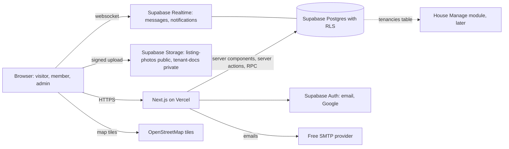
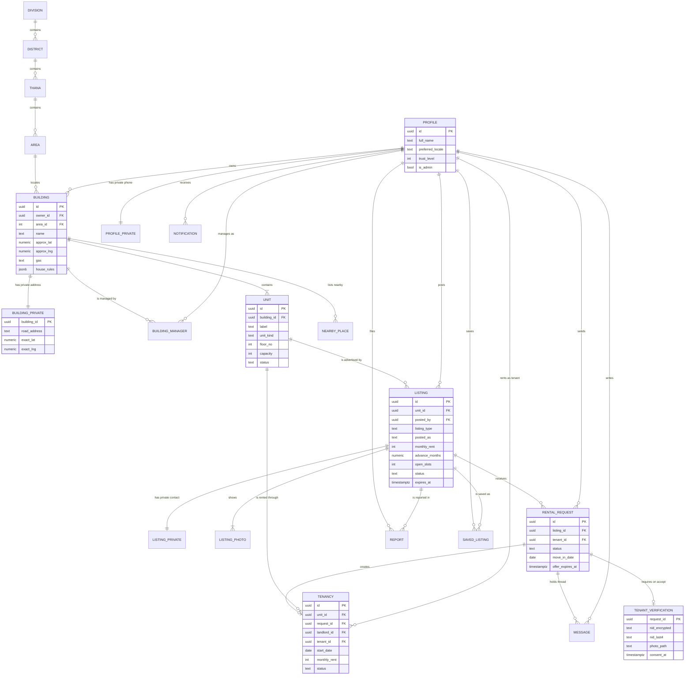
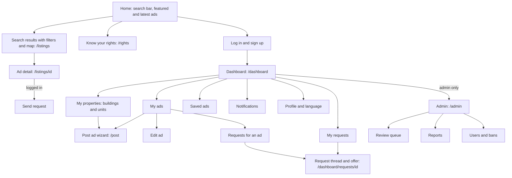
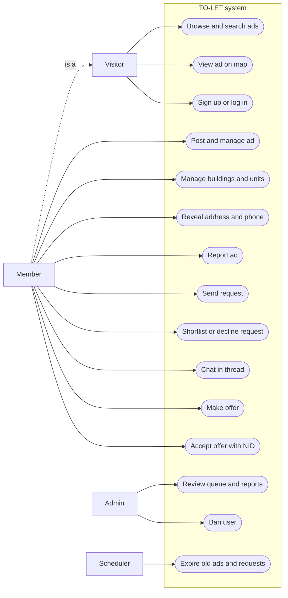
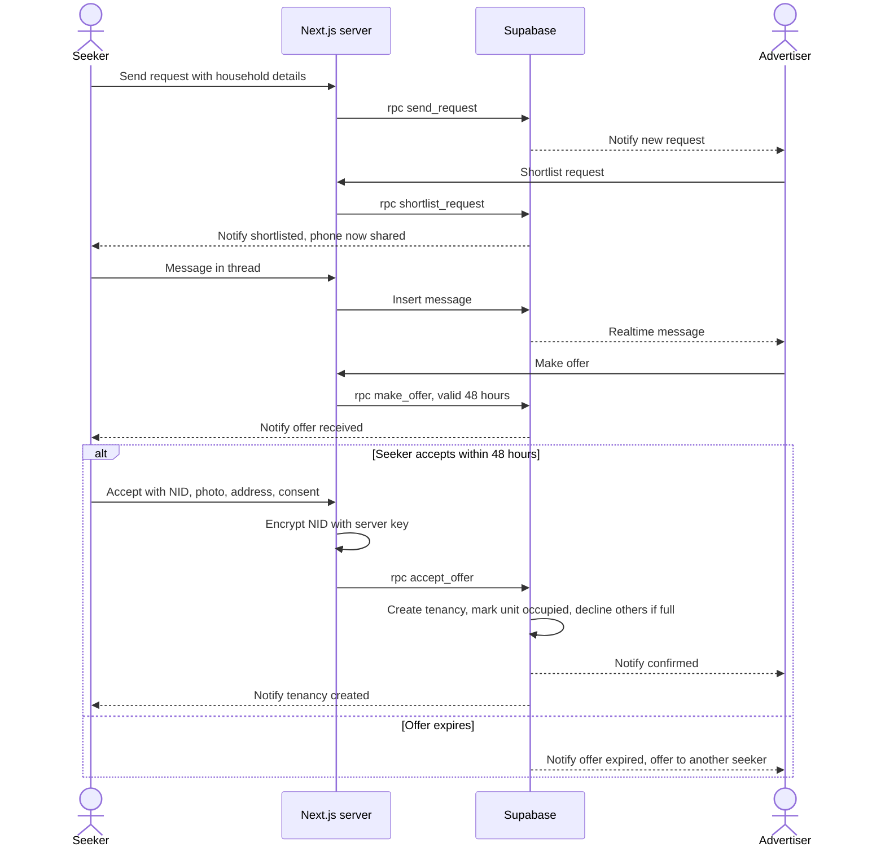
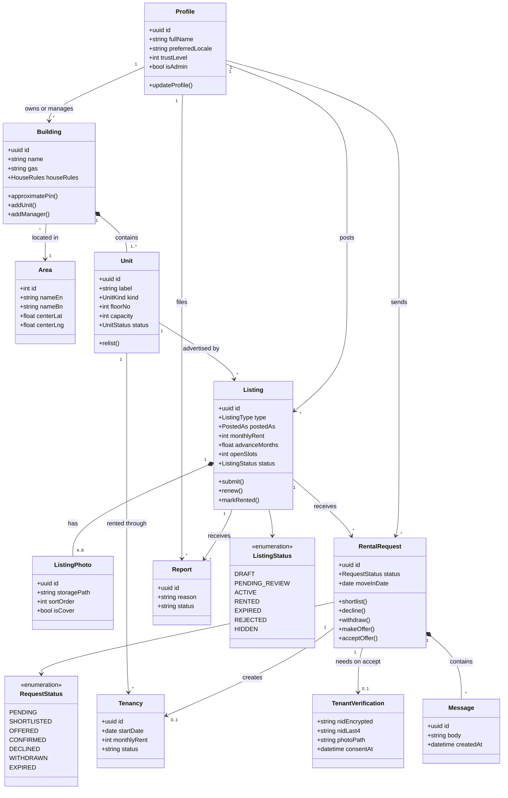

# PROJECT_PLAN.md
Project: House Manager (Part 1: TO-LET)
Version: 0.2 (buildings and units added so TO-LET feeds House Manage)
Date: 2026-10-03
Type: University project (CSE 400, Software Development IV, Fall 2026, BUBT), planned to grow into a production product
Main reference: Bari Bhara Blueprint

## 1. Summary
House Manager is a broker-free rental platform for Bangladesh. Part 1, TO-LET, lets owners, caretakers and subletting tenants post rental ads, and lets people find them and send rental requests. Ads are attached to units inside the landlord's buildings, which are entered once. When a landlord confirms a tenant, a tenancy is created for that unit, and that is where Part 2, House Manage, begins.

MVP goal: a landlord in Mirpur posts an ad, a tenant finds it through search or the map, sends a request, they talk in a message thread, the landlord makes an offer, the tenant accepts with NID details, and a tenancy is created.

### 1.1 Scope of this plan
- In scope: everything in TO-LET, from sign-up to tenancy creation.
- Out of scope: House Manage (rent ledger, receipts, utilities, maintenance, agreements, DMP form export), online payments, phone OTP, the mobile app.
- Shared with House Manage: `buildings`, `units` and `tenancies`. TO-LET creates them, House Manage builds on them (section 1.9).
- Geography: the data model covers all of Bangladesh (division, district, thana, area). Seed data and testing focus on Mirpur.

### 1.2 Users and roles
There is one kind of account. What a person can do depends on what they are doing, not on a role picked at sign-up.

| Role | Who | Can do |
|---|---|---|
| Visitor | Anyone, no account | Browse ads, search, filter, see the map with approximate pins |
| Member | Anyone with an account | Everything a visitor can, plus see exact address, reveal phone, save ads, report ads, post ads, send requests |
| Advertiser | A member who posted an ad | Manage that ad and the requests it receives |
| Seeker | A member who sent a request | Track that request, chat, accept an offer |
| Admin | Team members with `is_admin = true` | Review queue, handle reports, hide ads, ban users |

Examples:
- Rahim rents a flat in Mirpur 10. He sends requests for a bigger flat (seeker), and he also posts his spare room as a sublet (advertiser). With one account he does both.
- Karim owns a building in Pallabi and rents out every flat in it, while he himself lives as a tenant in Uttara. He is a landlord through his building and a tenant through his own tenancy, on the same account.

With separate landlord and tenant accounts, both would need two emails.

**Mode switch, so each person only sees what they use.** Sign-up asks one question: "Find a home" or "Rent out my property". That sets `default_mode` (seek or host) and which dashboard opens. Seekers see only search, requests, saved ads and, later, their rent and building community. Landlord menus (My properties, My ads, requests inbox) appear once a person adds a building or switches to landlord mode from the menu. A tenant who wants to sublet gets a short "Sublet a room" flow tied to their own tenancy, without the full landlord dashboard.

Advertisers say who they are when posting (`posted_as`):
- `owner`: the property owner.
- `caretaker`: posting for the owner. Either the owner added them as a building manager, or, if the owner is not on the platform, they enter the owner's name.
- `tenant_sublet`: a tenant subletting part of their flat. Must tick "I have the owner's written permission to sublet" (agreement template clause 11). If their own tenancy is on the platform, the ad attaches to their unit. If not, they add the building and unit themselves, and the building stays unclaimed until the owner joins.

Brokers are not allowed. This is enforced by policy, auto-checks and reports (section 1.6).

### 1.3 Listing types (first release)
- `flat`: a whole flat. Family or bachelor is set by `tenant_types`.
- `room`: a single room in a flat.
- `sublet`: part of a flat shared with the current family or tenant.
- `mess_seat`: a seat in a mess room. `open_slots` is the number of seats this ad offers.

Tenant types (multi-select): `family`, `bachelor_male`, `bachelor_female`, `student`, `job_holder`.

Later: commercial (shop, office), garage or parking, female hostel.

### 1.4 The request flow
This is the core of TO-LET and the bridge to House Manage.

| Status | Meaning | Who moves it |
|---|---|---|
| `pending` | Tenant sent a request | Tenant |
| `shortlisted` | Landlord is interested. Tenant's phone is now shared | Landlord |
| `offered` | Landlord offers the place to this tenant. Valid for 48 hours | Landlord |
| `confirmed` | Tenant accepted and submitted NID details. Tenancy created | Tenant |
| `declined` | Landlord said no, or the place was filled | Landlord or system |
| `withdrawn` | Tenant cancelled | Tenant |
| `expired` | No action for 14 days, or the offer passed 48 hours | System |

Rules:
- One open request per tenant per listing.
- A tenant can have at most 10 open requests at a time (anti-spam).
- A landlord can shortlist many requests but can have only as many open offers as `open_slots` (1 for a flat, more for mess seats).
- On confirm, in one database transaction: the tenancy is created for the unit, `open_slots` goes down by one, and if it reaches zero the listing becomes `rented`, the unit becomes `occupied`, and every other open request is declined with a polite automatic message.
- Both sides confirm. The landlord offers, the tenant accepts. Neither can create a tenancy alone.

### 1.5 What is shared, and when
Personal data is shared in stages. A fake ad must not be able to collect NID numbers from dozens of applicants, and the Personal Data Protection Act 2026 asks for minimum collection with consent.

| Stage | Tenant shares | Landlord shares |
|---|---|---|
| Visitor browsing | nothing | Photos, rent, costs, area, features, rules, approximate pin |
| Logged in | nothing | Exact address, exact pin, phone (reveal button, rate-limited) |
| Request sent | Name, profile photo, household type, number of members, occupation, move-in date, message | nothing new |
| Shortlisted | Phone number | nothing new |
| Offer accepted | NID number, a current photo, permanent address, consent tick | nothing new |

Storage rules:
- The NID number is encrypted on the server before it is saved. Only the last 4 digits are stored in plain text, for display.
- No NID card image is stored.
- The tenant photo goes to a private storage bucket that only the tenant and that landlord can read.
- If a tenancy is cancelled before it starts, the NID data is deleted.
- The remaining DMP form fields (previous address, family members and so on) are collected later in House Manage.

### 1.6 Moderation
Manual review of every ad does not scale, and fake or broker ads are the main problem the Blueprint describes, so moderation works in layers. The team only looks at what the layers flag.

1. **Automatic checks on submit:** required fields, at least 4 photos, duplicate detection (the unit already has an active ad, or the same photo hash appears on another ad), one phone number used on more than 3 active ads (broker signal), banned words (for example "commission", "কমিশন", "দালাল"), rent far outside the area's usual range.
2. **Trust levels:** a new member is level 0, so their first ad goes to the review queue. After one approved ad with no upheld reports they become level 1, and their ads publish directly. Flagged ads always go to the queue.
3. **Community reports:** reasons are broker, fake, already rented, wrong info, discriminatory, offensive, other. Three reports from different members hide the ad until an admin checks it.
4. **Admin queue:** approve, reject with a reason, hide, restore, ban.

In the coursework version, the five team members are the admins. At scale, a small moderation team works the queue. A later B2B route: housing societies or building committees (residential areas such as Mirpur DOHS) get an organization account, and the ads they verify get a "society verified" badge. That spreads verification work to people who actually know the buildings.

### 1.7 Monetization (production, not built now)
- Free for tenants, always.
- Free basic ads for landlords.
- Revenue later: featured or boosted ads paid by bKash, a House Manage subscription for landlords above a set number of units, a paid verification badge (NID verified owner), and housing society partnerships.
- No commission on rentals. Bproperty's commission-heavy model failed in this market (Blueprint, Part B).
- The only data model hook needed now: `is_featured` and `featured_until` on listings.

### 1.8 Local rules built into TO-LET
- If `advance_months` is above 1, the form shows a warning that Section 10 of the Premises Rent Control Act 1991 allows one month, with a link to a rights page. The ad can still be posted, because the market differs.
- Sublet by a tenant requires the permission tick. A caretaker must name the owner.
- A bilingual "Know your rights" page summarises the Act, marked as general information, not legal advice.
- Ads cannot require a religion, caste or ethnicity. There is no field for it, and "discriminatory" is a report reason.
- A consent tick is required before NID details are submitted.

### 1.9 Built for House Manage
House Manage will be planned separately, but TO-LET is built so it plugs straight in.

- **Roles come from relationships.** A person is a landlord through the buildings they own or manage, and a tenant through their tenancies. Anyone can be both at once.
- **Properties are entered once.** A landlord adds a building (address, pin, gas, facilities, house rules) and its units (flats, rooms, mess rooms) the first time they post. Every later ad picks from that list. House Manage's "My properties" dashboard uses the same records, so a landlord with three buildings never types an address twice.
- **Ads belong to units.** A unit can have one active ad at a time. When a tenancy is confirmed, the unit becomes occupied. When a tenancy ends in House Manage, the unit becomes vacant again and the landlord re-lists it in one click, with the old details and photos pre-filled.
- **House rules live on the building.** Every ad in that building shows them, and House Manage later shows them to its tenants.
- **Building community is possible because everyone points to one building record.** Tenancies point to units, units point to buildings, so the members of a building are its owner, its managers (caretakers) and its active tenants.
- **Caretakers are building managers.** An owner adds a caretaker to a building. The caretaker can post ads now and manage tenants later.

Planned House Manage modules, for its own planning round:
- My properties dashboard (buildings, units, vacancy)
- Tenants per unit, with DMP form data and export
- Rent ledger, utilities, and Section 13 receipts
- House rules, notices, agreements
- Maintenance requests
- Building community: notice board, group chat, help posts, emergency alerts

## 2. Stack decision and justification

What this app needs: public ad pages that Google and Facebook can read, relational data (listings, requests, tenancies), login, photo uploads, a light realtime message thread, strict privacy rules, two languages, free hosting, a team of five students, and a backend a future Flutter app can reuse.

- **Frontend: Next.js (App Router) with TypeScript, Tailwind CSS and shadcn/ui.**
  Why: ad pages are rendered on the server, so they show up in Google searches like "flat rent Mirpur 10" and show a proper preview when shared on Facebook, where most Dhaka renters look. The dashboard and admin panel live in the same codebase. It has the most tutorials and examples, which matters for a team of five.
  Rejected: React with Vite as a single-page app (ad pages are invisible to Google and Facebook previews are empty), Astro (built for content sites, this is an app), SvelteKit (smaller ecosystem, the team would learn a new framework).
- **Backend: Supabase, with Next.js server actions for logic.**
  Why: one free service gives Postgres, auth with Google, file storage and realtime. Row Level Security enforces the privacy table in section 1.5 inside the database, so a bug in the UI cannot leak an address or NID. Request state changes run as Postgres functions in one transaction, so the rules in section 1.4 cannot be skipped. Supabase has an official Flutter SDK, so the future app reuses the same backend.
  Rejected: Firebase (Firestore cannot easily combine several range filters such as rent range plus size range, and requests and tenancies are relational), Laravel or Django (need an always-on server, free hosts have cold starts, and auth, uploads and realtime would be built by hand), Express with MongoDB (same extra work, and a document database fits this data poorly).
- **Database: Postgres (Supabase).** Relational data with real foreign keys. `pg_trgm` for fuzzy area and keyword search in both languages. Map search uses a latitude and longitude bounding box with normal indexes, which is enough at Mirpur scale. PostGIS can be added later.
- **Auth: Supabase Auth** with email and password plus Google. Phone OTP later through an SMS provider.
- **Storage: Supabase Storage.** Photos are compressed in the browser to WebP, longest side 1600px, around 250 KB each, before upload.
- **Maps: Leaflet with react-leaflet and OpenStreetMap tiles.** No geocoding API. The landlord drags a pin, which starts at the area's centre.
- **Languages: next-intl,** with `/bn` (default) and `/en` routes and all text in `messages/bn.json` and `messages/en.json`.
- **Hosting: Vercel Hobby,** connected to GitHub. Every pull request gets its own preview link, which is useful for team review.

Free-tier gotchas that affect this project (verify current limits on each provider's page):
- **Supabase pauses a free project after about 7 days without activity.** Open it before every demo and the viva. A weekly GitHub Action that runs one small query is a common fix.
- **Supabase's built-in email sender allows only a few emails per hour.** Sign-up confirmation emails will fail during testing with five people. Connect a free SMTP provider (for example Resend or Brevo) in F1.
- **Supabase free storage is about 1 GB.** At about 1.5 MB per ad after compression, that is several hundred ads, enough for coursework.
- **Vercel Hobby does not allow commercial use.** Move to a paid plan or another host before charging money.
- **Vercel's image optimization has a monthly quota on Hobby.** Photos are already compressed, so serve them directly instead of through Next.js image optimization.
- **The public OpenStreetMap tile servers do not allow heavy traffic.** Fine for coursework. Switch to a tile provider for production.
- Supabase free allows two projects: use one for development and one for the demo.

## 3. Architecture diagram



## 4. Data model

Every table has Row Level Security. Public reads go through the `listings_public` view, which leaves out private columns.

**Location (seeded)**
- `divisions`: id, name_en, name_bn
- `districts`: id, division_id, name_en, name_bn
- `thanas`: id, district_id, name_en, name_bn
- `areas`: id, thana_id, name_en, name_bn, center_lat, center_lng
- Mirpur seed (verify against the DMP thana list): thanas Mirpur Model, Pallabi, Kafrul, Shah Ali, Rupnagar, Darus Salam, Bhashantek. Areas such as Mirpur 1, 2, 6, 7, 10, 11, 12, 13, 14, Kazipara, Shewrapara, Senpara Parbata, Pirerbag, Monipur, Mirpur DOHS, Kalshi.

**People**
- `profiles`: id (same as auth user id), full_name, avatar_url, preferred_locale (bn or en), default_mode (seek or host), is_admin, trust_level (0 or 1), is_banned, created_at. Readable by everyone.
- `profile_private`: user_id, phone, phone_verified. Readable by the user, and by a landlord once that user's request is shortlisted or later.

**Properties (shared with House Manage)**
- `buildings`: id, created_by, owner_id (empty while unclaimed), name (for example "Rahman Villa"), area_id, landmark, approx_lat, approx_lng, total_floors, gas (titas_line, lpg, none), amenities (array: lift, parking, generator, security_guard, cctv, rooftop), house_rules (pets, smoking, guests, gate closing time, rooftop use, plus free text), created_at, updated_at.
- `building_private`: building_id, road_address, house_no, exact_lat, exact_lng, offset_lat, offset_lng (the fixed offset behind the public pin). Readable by logged-in members while the building has an active ad, by the building's managers, and by its active tenants.
- `building_managers`: building_id, user_id, role (owner, caretaker), added_by, created_at.
- `units`: id, building_id, label (for example "4B", "Room 2", "Mess room 1"), unit_kind (flat, room, mess_room), floor_no, size_sqft, bedrooms, bathrooms, balconies, facing, furnishing, capacity (beds in a mess room, otherwise 1), status (vacant, listed, occupied), created_at, updated_at.
- `nearby_places`: id, building_id, kind (metro, bus_stop, market, school, hospital, mosque, park), name, walk_minutes. Entered once per building, shown on every ad in it.

**Listings (one ad for one unit)**
- `listings`: id, unit_id, posted_by, posted_as (owner, caretaker, tenant_sublet), owner_name (caretaker whose owner is not on the platform), sublet_consent (tenant_sublet only), listing_type (flat, room, sublet, mess_seat), tenant_types (array), title, description, open_slots (default 1, seats for mess_seat), max_occupants, monthly_rent, rent_negotiable, advance_months, service_charge, electricity (prepaid, postpaid, included), water (included, tenant_pays), gas_bill (included, tenant_pays, empty when the building has no gas), other_charges, extra_rules (on top of the building's house rules), agreement_required, dmp_form_required (default true), available_from, status (draft, pending_review, active, rented, expired, rejected, hidden), rejection_reason, published_at, expires_at (published_at plus 30 days), is_featured, featured_until, view_count, created_at, updated_at.
- `listing_private`: listing_id, contact_phone, whatsapp. Readable directly only by the poster and the building's managers. Other logged-in members get the numbers of a live ad through `reveal_contact`, limited to 20 ads a day (since F3).
- `listing_photos`: id, listing_id, storage_path, sort_order, is_cover, width, height, content_hash (duplicate detection). Copied when a unit is re-listed. The first photo (sort_order 0) is always the cover. Visible exactly when the ad is visible. Written only through `add_listing_photo`, `remove_listing_photo` and `reorder_listing_photos` (since F3).

**Requests and tenancy**
- `rental_requests`: id, listing_id, tenant_id, status (section 1.4), household_type, members_count, occupation, move_in_date, message, offer_expires_at, decline_reason, created_at, updated_at.
- `messages`: id, request_id, sender_id, body, created_at, read_at. Readable only by the two people on that request.
- `tenant_verifications`: request_id, tenant_id, nid_encrypted, nid_last4, photo_path (private bucket), permanent_address, consent_at, created_at. Readable only by the tenant and the listing's owner.
- `tenancies`: id, unit_id, listing_id, request_id, landlord_id (the poster, so a subletting tenant is the landlord of their sub-tenant), tenant_id, start_date, monthly_rent, advance_amount, status (active, ended, cancelled), created_at. House Manage starts here.

**Trust and engagement**
- `reports`: id, listing_id, reporter_id, reason, details, status (open, upheld, dismissed), resolved_by, created_at.
- `moderation_actions`: id, admin_id, listing_id, user_id, action (approve, reject, hide, restore, ban, unban), note, created_at.
- `contact_reveals`: id, user_id, listing_id, created_at. Limits phone reveals to 20 a day per member and flags scrapers.
- `saved_listings`: user_id, listing_id, created_at.
- `notifications`: id, user_id, type, data (json), read_at, created_at.
- `viewing_slots` (F11): id, listing_id, starts_at, ends_at, booked_request_id.

**Approximate pin:** when a building is added, the exact pin is rounded and moved by a random offset of up to about 250 metres. The offset is saved once, so the public pin never moves. If it changed on every page load, someone could average many loads and find the real spot.

**Database functions (called with `supabase.rpc`, each one checks the current status and the caller):** `submit_listing`, `relist_unit`, `send_request`, `shortlist_request`, `decline_request`, `withdraw_request`, `make_offer`, `accept_offer`, `report_listing`, `reveal_contact`. A scheduled job expires old requests, offers and ads.

**Key indexes:** buildings (area_id), buildings (approx_lat, approx_lng), units (building_id, status), listings (status, monthly_rent), listings (unit_id) unique where status is active, GIN on tenant_types and building amenities, trigram on title and area names, rental_requests (listing_id, status), messages (request_id, created_at).

## 5. ER diagram



## 6. Site map



All routes sit under a language prefix: `/bn/...` (default) and `/en/...`.

## 7. Folder structure

```
house-manager/
  docs/
    PROJECT_PLAN.md
    srs/
    diagrams/
  messages/
    bn.json
    en.json
  public/
    icons/
    og-default.png
  src/
    app/
      [locale]/
        layout.tsx
        page.tsx
        listings/
          page.tsx
          [id]/
            page.tsx
        post/
          page.tsx
        login/
          page.tsx
        signup/
          page.tsx
        dashboard/
          layout.tsx
          page.tsx
          properties/
            page.tsx
            [buildingId]/
              page.tsx
          ads/
            page.tsx
            [id]/
              edit/
                page.tsx
              requests/
                page.tsx
          requests/
            page.tsx
            [id]/
              page.tsx
          saved/
            page.tsx
          notifications/
            page.tsx
          profile/
            page.tsx
        admin/
          layout.tsx
          page.tsx
          queue/
            page.tsx
          reports/
            page.tsx
          users/
            page.tsx
        rights/
          page.tsx
        privacy/
          page.tsx
        terms/
          page.tsx
      auth/
        callback/
          route.ts
      sitemap.ts
      robots.ts
    components/
      ui/
      layout/
      listings/
      properties/
      wizard/
      requests/
      admin/
    lib/
      supabase/
        client.ts
        server.ts
        middleware.ts
      validation/
        listing.ts
        request.ts
      crypto/
        nid.ts
      geo/
        approx-pin.ts
      images/
        compress.ts
      utils.ts
    i18n/
      routing.ts
      request.ts
    middleware.ts
  supabase/
    config.toml
    migrations/
    seed.sql
  tests/
    unit/
    e2e/
  .env.example
  .github/
    workflows/
      ci.yml
      keep-alive.yml
  package.json
  README.md
```

## 8. Build tools
- Editor: VS Code (Windows), with ESLint, Prettier, Tailwind CSS IntelliSense, and the Supabase extension
- Test browser: Chrome (plus Chrome device mode at 360px for mobile)
- Runtime: Node.js LTS
- Package manager: npm (simplest for a five-person team on Windows)
- Framework CLI: `npx create-next-app@latest`, `npx shadcn@latest`
- Database: Supabase CLI for migrations (`supabase db push`) against a cloud dev project, so nobody needs Docker
- Validation: zod schemas shared by the form and the server action
- Tests: Vitest (unit), Playwright (two or three end-to-end flows)
- Deploy: Vercel connected to GitHub, auto-deploy on `main`, preview on every pull request
- Version control: Git and GitHub, one branch per feature, pull request with at least one teammate review, synced to the Claude Project

## 9. Feature roadmap

Each feature is small enough to build, test and deploy on its own.

- [x] **F1: Foundation.** Next.js app with Tailwind, shadcn/ui and next-intl (bn and en). Header with language toggle, footer. Supabase connected. Sign up with email and password, Google sign-in, log out. Profile page (name, photo, phone, language). Sign-up question that sets the default mode, and mode-based menus with a switch. Free SMTP connected. Deployed to Vercel.
  Done when: a teammate opens the live link on a phone, switches to English, signs up with Google, and edits their profile.
- [x] **F2: Properties and posting an ad (text).** Location tables seeded (Bangladesh divisions and districts, Mirpur thanas and areas). Wizard: (1) pick a building or add one (name, location, pin, gas, facilities, house rules, nearby places), (2) pick a unit or add one, (3) ad type and who is posting, (4) costs with the advance warning, (5) tenant types and extra rules, (6) review. Save as draft, submit. A simple "My properties" page lists buildings and units with their status.
  Done when: a member adds one building with two units, posts a flat ad for one unit, starts a second ad without retyping the address, and sees the advance warning above one month.
- [x] **F3: Photos and ad page.** Upload 4 to 8 photos with browser compression, reorder, choose cover. Public ad detail page with gallery, approximate pin, costs table, rules. Exact address and phone reveal only for logged-in members. Basic SEO metadata and a share preview.
  Done when: a logged-out visitor sees the ad without the address, and logs in to see it.
- [ ] **F4: Browse, search, map.** Home page, search by area or keyword, filters (rent range, type, tenant type, bedrooms, amenities, gas, available from), sort (newest, rent low to high), map view with markers inside the visible area, pagination.
  Done when: filtering "Mirpur 10, bachelor_male, gas line, under 15,000" shows only matching ads, both as a list and on the map.
- [ ] **F5: Moderation.** Auto-checks on submit, trust levels, first ad to review queue, report button, auto-hide at 3 reports, admin pages (queue, reports, users).
  Depends on F2 and F3.
  Done when: a new member's first ad waits in the queue, an admin approves it, and the member's second ad goes live directly.
- [ ] **F6: Rental requests.** Send request form, "My requests", requests inbox per ad, shortlist, decline with reason, withdraw. Phone shared on shortlist. Request limits.
  Depends on F3.
- [ ] **F7: Message thread.** One thread per request, live updates with Supabase Realtime, unread counts.
  Depends on F6.
- [ ] **F8: Offer and confirm.** Make offer (48 hours), accept with NID number, photo, permanent address and consent, NID encrypted on the server, tenancy created in one transaction, other requests auto-declined when full.
  Depends on F6.
  Done when: with two seekers on one flat, accepting the offer creates one tenancy, marks the ad rented, and declines the other seeker automatically.
- [ ] **F9: Notifications.** In-app bell plus email for new request, shortlisted, offer, confirmed, declined, ad approved or rejected.
- [ ] **F10: Managing ads and properties.** Edit, pause, renew, 30-day expiry with reminder, mark as rented manually, re-list a vacant unit with details and photos pre-filled, add a caretaker to a building, saved ads.
- [ ] **F11: Viewing slots.** Landlord adds time slots, a shortlisted seeker books one.
- [ ] **F12: Polish.** Sitemap, structured data, Lighthouse pass, accessibility check, keep-alive workflow, Playwright tests for the request-to-tenancy flow.

**Later, for production (not part of the course):** phone OTP, featured ads paid with bKash, NID verified badge, housing society accounts, moderation team tools, tile provider for maps, Flutter app on the same Supabase backend, commercial and garage ads.

## 10. Decisions log
| Date | Decision | Reason | Alternatives rejected |
|---|---|---|---|
| 2026-10-03 | Next.js (App Router) | Server-rendered ad pages for Google and Facebook previews, dashboard in the same codebase, large ecosystem | React SPA (no SEO), Astro (content-first), SvelteKit (learning cost) |
| 2026-10-03 | Supabase | Postgres, auth, storage and realtime in one free service. RLS enforces privacy in the database. Flutter SDK for the future app | Firebase (weak multi-filter queries, NoSQL), Laravel or Django (server to host, more code), Express with MongoDB (hand-built auth and uploads) |
| 2026-10-03 | Vercel Hobby | Best Next.js hosting, PR previews for team review | Render (cold starts), Netlify (fine, weaker Next.js support) |
| 2026-10-03 | Leaflet with OpenStreetMap, no geocoding | Free, no billing account | Google Maps (needs billing) |
| 2026-10-03 | One account per person, with a seek or host mode switch | A tenant can sublet, a landlord can rent elsewhere, tenants later become owners, and one phone per account blocks brokers. The mode switch keeps menus simple | Separate landlord and tenant accounts (sublets need landlord features anyway, duplicate profiles and NID records) |
| 2026-10-03 | Residential ads first, including sublet and mess seat | Most common in Mirpur | Commercial and garage now |
| 2026-10-03 | Owners, caretakers and subletting tenants can post, brokers cannot | "No broker" is the main promise | Open posting |
| 2026-10-03 | Exact address and phone only after login, pin offset for visitors | Reduces scraping and protects owners | Fully public details |
| 2026-10-03 | Staged disclosure, NID only after an accepted offer | Stops fake ads harvesting NIDs, follows PDPA 2026 minimum collection | NID with every request |
| 2026-10-03 | Two-sided confirmation (offer, then accept) | Neither side can create a tenancy alone | Landlord-only confirm |
| 2026-10-03 | Layered moderation | Scales without reviewing every ad | Manual review of all ads |
| 2026-10-03 | Free tier only, monetization later with no commission | Course budget. Commission model failed for Bproperty | Commission per rental |
| 2026-10-03 | Ads attach to units inside buildings, entered once per landlord | Landlords with several properties, one-click re-listing, building-level house rules, and a building community in House Manage all need one shared building record | Each ad carrying its own full address and property details |
| 2026-10-03 | Caretakers are building managers added by the owner | The same role can post ads now and manage tenants later | A posted_as flag only |
| 2026-10-05 | Vercel Functions run in Singapore (sin1), set in vercel.json | The database is in Singapore. Vercel's default (Washington) added about a second to every page | Default region |
| 2026-10-05 | Pages check the login with getClaims and run lookups in parallel | getClaims checks the token locally, getUser asks the Auth server every time | getUser on every page |
| 2026-10-05 | The building form has four short parts (basics, address and pin, facilities and rules, nearby places) | Keeps each part at about six fields (U1 usability rule) | One long form |
| 2026-10-05 | Who is posting comes from the person's link to the building (owner, caretaker, or the tenant who added it) | The same person cannot claim different roles on different ads for one building | Free choice per ad |
| 2026-10-05 | One open ad per unit, drafts included | Stops two managers drafting the same unit, and keeps "one active ad per unit" simple | Several drafts per unit |
| 2026-10-05 | In F2, Publish makes an ad live straight away | Photos (F3) and moderation (F5) are not built yet. F3 added the 4 photo minimum, F5 adds the review queue | Waiting for review from F2 |
| 2026-10-05 | Added gas_bill to listings | Who pays for gas is one of the first questions in Dhaka ads | Leaving it to other_charges |
| 2026-10-06 | Photos are a wizard step of their own (step 6), and the cover is always the first photo | One clear place for photos, and "make cover" is the same as moving a photo to the front | Photos inside step 3, a separate cover flag |
| 2026-10-06 | Photo files go to `<user id>/<listing id>/` and rows are added by a database function that checks the file exists, the draft, the 8 photo limit and duplicates | A browser cannot attach someone else's file or go past the limit | Inserting rows straight from the browser |
| 2026-10-06 | Photos can be changed only while the ad is a draft | Editing live ads belongs to F10 (edit, pause, renew) | Editing live ads now |
| 2026-10-06 | Phone numbers through `reveal_contact`, 20 different ads per member per 24 hours; the same ad again is free | Plan FR12. In F2 any member could read every number directly, which made scraping easy | Reading `listing_private` directly |
| 2026-10-06 | Visitors cannot read the building name (column grant) | The name is often the name on the gate or the house and road number, which would defeat the approximate pin | Showing the name to everyone |
| 2026-10-06 | Visitors see a 300 metre circle instead of a pin | A pin looks exact even when it is moved; the circle shows that the spot is approximate | Showing the offset pin |
| 2026-10-06 | Publishing opens the ad's own page with a "your ad is live" note | The landlord sees what tenants see and can share the link right away | Back to My ads |

## 11. Open questions
- Submission deadlines and the marking scheme for CSE 400.
- Confirm teammate ownership (section U4), Mollika's full student ID, and name spellings for the report.
- Public product name: House Manager, or a Bangla brand name.
- Verify the Mirpur thana and area list against the current DMP list.
- Lawyer review of the rights page wording before production.
- Duplicate buildings: two people may add the same building (for example two subletting tenants). For the course, only the creator and owner see a building's units. For production, plan a claim and merge flow where the real owner claims an unclaimed building.

---
## University sections

## U1. SRS (IEEE 830 outline)

### 1. Introduction
- **Purpose:** defines the requirements for the TO-LET module of House Manager, for the CSE 400 team, the course teacher and the evaluation board.
- **Scope:** a bilingual web platform where owners, caretakers and subletting tenants post residential rental ads in Bangladesh, starting in Mirpur, and members send rental requests that end in a confirmed tenancy. Rent collection and tenancy management are in House Manage and are out of scope.
- **Definitions:** Ad or listing (a rental advertisement), Advertiser (member who posts), Seeker (member who requests), Request, Offer, Tenancy, Thana, DMP (Dhaka Metropolitan Police), NID (national identity card), RLS (Row Level Security), PDPA (Personal Data Protection Act 2026).
- **References:** Bari Bhara Blueprint, Premises Rent Control Act 1991, DNCC rent guidelines (January 2026), Personal Data Protection Act 2026, IEEE 830.
- **Overview:** section 2 describes the product, section 3 lists requirements.

### 2. Overall description
- **Product perspective:** a new web system, first of two modules. It hands confirmed tenancies to House Manage.
- **Product functions:** browse and search ads, post ads, moderate ads, send and manage requests, message, offer and confirm, notify.
- **User characteristics:** landlords may be older and less technical (needs a simple Bangla step-by-step form). Seekers are mostly young, mobile-first, often bachelors. Admins are trained team members.
- **Constraints:** free hosting tiers, Bangla and English, mobile-first, PDPA 2026, no payments in this release.
- **Assumptions and dependencies:** Supabase, Vercel and OpenStreetMap stay available on free tiers. Users have email or a Google account.
- **Apportioning of requirements:** phone OTP, payments, viewing slots (if time runs out) and commercial ads are deferred.

### 3. Specific requirements

**External interfaces:** web UI from 360px wide upward, Supabase API, Google OAuth, SMTP email, OpenStreetMap tiles.

**Functional requirements**

| ID | Requirement | Priority | Feature |
|---|---|---|---|
| FR1 | The system shall let visitors browse active ads without an account | High | F4 |
| FR2 | The system shall show an ad detail page with an approximate pin and without the exact address or phone for visitors | High | F3 |
| FR3 | The system shall let a user register with email and password and confirm the email | High | F1 |
| FR4 | The system shall let a user sign in with Google | High | F1 |
| FR5 | The system shall let users switch between Bangla and English and remember the choice | High | F1 |
| FR6 | The system shall let members edit name, photo and phone | Medium | F1 |
| FR7 | The system shall let members create an ad with a step-by-step form and save drafts | High | F2 |
| FR8 | The system shall require a building location as division, district, thana and area, and a map pin | High | F2 |
| FR9 | The system shall warn when advance exceeds one month's rent | Medium | F2 |
| FR10 | The system shall require owner consent for tenant sublets and the owner's name for caretakers | Medium | F2 |
| FR11 | The system shall require 4 to 8 photos, compressed before upload | High | F3 |
| FR12 | The system shall show exact address and allow phone reveal only to logged-in members, limited to 20 reveals a day | High | F3 |
| FR13 | The system shall let users search by area or keyword | High | F4 |
| FR14 | The system shall filter by rent range, type, tenant type, bedrooms, amenities, gas and available date | High | F4 |
| FR15 | The system shall sort by newest and by rent | Medium | F4 |
| FR16 | The system shall show results on a map | Medium | F4 |
| FR17 | The system shall run automatic checks when an ad is submitted | High | F5 |
| FR18 | The system shall send a new member's first ad to review and publish trusted members' ads directly | High | F5 |
| FR19 | The system shall let members report an ad and hide it after 3 reports | High | F5 |
| FR20 | The system shall let admins approve, reject, hide, restore ads and ban users | High | F5 |
| FR21 | The system shall let members send a request with household details | High | F6 |
| FR22 | The system shall let advertisers shortlist or decline requests | High | F6 |
| FR23 | The system shall share the seeker's phone only after shortlisting | High | F6 |
| FR24 | The system shall let seekers withdraw requests and limit open requests to 10 | Medium | F6 |
| FR25 | The system shall provide a live message thread per request | Medium | F7 |
| FR26 | The system shall let advertisers make offers limited by the ad's open slots, valid for 48 hours | High | F8 |
| FR27 | The system shall let seekers accept an offer by submitting NID number, photo and permanent address with consent | High | F8 |
| FR28 | The system shall create a tenancy, update availability and decline other requests in one transaction | High | F8 |
| FR29 | The system shall notify users in the app and by email of request and moderation events | Medium | F9 |
| FR30 | The system shall let members save ads | Low | F10 |
| FR31 | The system shall let advertisers edit, pause, renew and mark ads rented, and expire ads after 30 days | Medium | F10 |
| FR32 | The system shall let advertisers publish viewing slots and shortlisted seekers book them | Low | F11 |
| FR33 | The system shall publish a sitemap and share previews for active ads | Medium | F12 |
| FR34 | The system shall let members add buildings and units once and choose them for later ads | High | F2 |
| FR35 | The system shall store house rules, facilities and nearby places on the building and show them on every ad in it | Medium | F2 |
| FR36 | The system shall let a building owner add caretakers as building managers | Low | F10 |
| FR37 | The system shall let advertisers re-list a vacant unit with its previous details and photos pre-filled | Medium | F10 |

**Performance:** ad and search pages load in under 3 seconds on a 4G phone. Search returns in under 1 second for 5,000 ads.

**Design constraints:** Next.js, Supabase, Vercel free tiers. All text in translation files.

**Software system attributes:**
- Security: RLS on every table, NID encrypted with a server-only key, private bucket for tenant photos, rate limits on reveals and requests.
- Privacy: staged disclosure (section 1.5), consent before NID, deletion when a tenancy is cancelled.
- Usability: Bangla by default, works at 360px, wizard steps of no more than six fields each.
- Availability: best effort on free tiers, keep-alive job.
- Maintainability: TypeScript, migrations in Git, shared validation schemas.

**Other requirements:** a "Know your rights" page, terms and privacy pages in both languages.

## U2. UML diagrams

### U2.1 Use case diagram



### U2.2 ER diagram
See section 5.

### U2.3 Sequence diagram: from request to tenancy



### U2.4 Class diagram



## U3. Deliverables and deadlines
Dates are to be filled in once the course schedule is known.

| Deliverable | Due date | Owner | Status |
|---|---|---|---|
| Project proposal | TBD | Sifat, all review | Not started |
| SRS | TBD | Sifat, Shihab | Draft in U1 |
| Design and UML | TBD | Ushno, Mollika | Draft in U2 |
| Prototype demo (F1 to F4) | TBD | All | Not started |
| Full implementation (F1 to F10) | TBD | All | Not started |
| Testing and results | TBD | Sulaiman | Not started |
| Final report | TBD | All, Sifat edits | Not started |
| Presentation and viva | TBD | All | Not started |

Suggested internal pace if no deadlines are set yet (two-week sprints):
- Sprint 1 (4 to 17 Oct): F1, start F2
- Sprint 2 (18 to 31 Oct): F2, F3, F4
- Sprint 3 (1 to 14 Nov): F5, F6
- Sprint 4 (15 to 28 Nov): F7, F8
- Sprint 5 (29 Nov to 12 Dec): F9, F10, F12, then F11 if time allows

## U4. Teammate feature ownership
Proposed split. Adjust it to each person's strengths.

| Feature | Owner | Notes |
|---|---|---|
| Team lead, schema, RLS, migrations, deploy | Samad Amin Sifat (20234103091) | Reviews every pull request touching the database |
| F6 and F8: requests, offer and confirm | Samad Amin Sifat | Hardest logic, database functions and NID encryption |
| F2 and F3: properties, post-ad wizard, photos, ad page | Maria Mastura Ushno (20234103070) | Works closely with the schema owner |
| F4 and F12: search, filters, map, SEO | Mollika Razin (072, full ID to confirm) | Owns Leaflet and the search query |
| F1, F7 and F9: auth, profile, i18n, messages, notifications | Shihab Ahmed (20234103104) | Starts first, F1 unblocks everyone |
| F5 and F10: moderation, admin panel, ad management | Sulaiman Khan (20234103249) | Also owns Playwright tests and the testing report |
